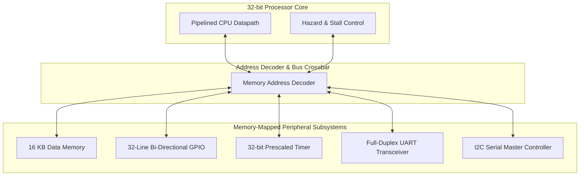

# M32 Microcontroller System-on-Chip (SkyWater 130nm)


A synthesizable 32-bit Microcontroller System-on-Chip (SoC) combining a pipelined CPU core with an on-chip memory-mapped peripheral subsystem, targeting the open-source SkyWater 130nm CMOS process (`sky130A`).

---

## 🗺️ SoC Memory Map & Interconnect

The processor interfaces with on-chip RAM and peripheral hardware controllers through a unified 32-bit memory-mapped address space:

```
0xFFFF_FFFF ┌─────────────────────────────────────────┐
            │          I2C Master Controller          │ 0x0000_0060 - 0x0000_006F
            ├─────────────────────────────────────────┤
            │         UART Transceiver (TX/RX)        │ 0x0000_0040 - 0x0000_004F
            ├─────────────────────────────────────────┤
            │       32-bit Timer with Prescaler       │ 0x0000_0020 - 0x0000_002F
            ├─────────────────────────────────────────┤
            │        32-Channel GPIO Subsystem        │ 0x0000_0010 - 0x0000_001F
            ├─────────────────────────────────────────┤
            │        On-Chip Data RAM (16 KB)         │ 0x0000_0000 - 0x0000_3FFF
0x0000_0000 └─────────────────────────────────────────┘
```

---

## 🏗️ Top-Level SoC Block Diagram



---

## 📦 Integrated Peripheral Subsystems

1. **GPIO Controller**: 32 software-configurable bidirectional I/O lines with direction masks (`tri_sig`), input registers (`pin`), and output registers (`pon`).
2. **UART Transceiver**: Asynchronous serial transmitter/receiver supporting programmable baud-rate division, framing, and TX/RX buffer status registers.
3. **Timer/Counter Subsystem**: 32-bit down-counter with programmable clock prescaler divider and periodic interrupt overflow generation.
4. **I2C Master Core**: Standard two-wire serial interface providing start/stop condition generation, byte acknowledge detection, and slave peripheral addressing.

---

## ⚙️ Hardware Specifications

| Parameter | Value / Specification |
| :--- | :--- |
| **Architecture** | 32-bit RISC Datapath |
| **Data Memory** | 16 KB On-Chip Synchronous RAM |
| **GPIO Count** | 32 Bi-directional Pins with Tri-state control |
| **Target PDK** | SkyWater 130nm Standard Cells (`sky130_fd_sc_hd`) |
| **Synthesis Tool** | Yosys Open Synthesis |

---

## 🛠️ Simulation & ASIC Synthesis Flow

### 1. Functional Simulation (Icarus Verilog):
```bash
# Compile SoC core and peripheral testbench
iverilog -o sim/mcu_sim.vvp rtl/*.v tb/tb_top.v

# Execute simulation
vvp sim/mcu_sim.vvp

# Open waveforms in GTKWave
gtkwave sim/waveform.vcd
```

### 2. Logic Synthesis to SkyWater 130nm:
```bash
cd synth
yosys synth.ys
```
